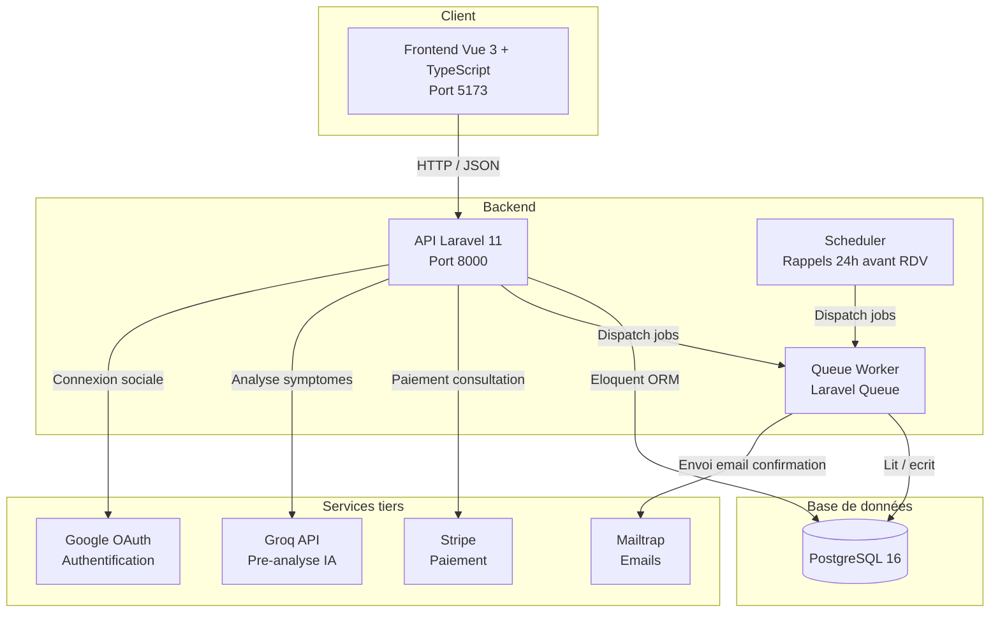

# Architecture de MediConnect

## Description des composants

- **Frontend** : application Vue 3 (TypeScript), consomme l'API REST via Axios, gère l'état d'authentification avec Pinia et la navigation avec Vue Router.
- **API Laravel** : expose les routes REST (authentification, créneaux, rendez-vous, paiements), protégées par Sanctum (tokens JWT) et un middleware de rôles (patient/médecin/admin).
- **Queue Worker** : traite en arrière-plan l'envoi des emails transactionnels, pour ne pas bloquer les réponses de l'API.
- **Scheduler** : déclenche toutes les heures une commande qui vérifie les rendez-vous à venir dans 24h et programme les rappels.
- **PostgreSQL** : stocke toutes les données métier (utilisateurs, créneaux, rendez-vous, paiements).
- **Services tiers** : Stripe pour le paiement, Groq pour la pré-analyse IA des symptômes, Mailtrap pour les emails de test, Google OAuth pour la connexion sociale.