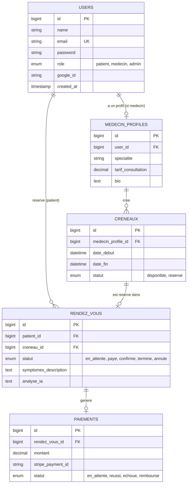

# Schéma de la base de données — MediConnect

## Relations principales

- Un **utilisateur** (`users`) peut être patient, médecin ou admin selon le champ `role`.
- Un médecin possède un **profil médecin** (`medecin_profiles`) contenant sa spécialité et son tarif.
- Un profil médecin crée plusieurs **créneaux** (`creneaux`) de disponibilité.
- Un patient réserve un créneau, ce qui crée un **rendez-vous** (`rendez_vous`), qui passe par les statuts `en_attente` → `paye` → `confirme`.
- Un rendez-vous payé génère un enregistrement dans **paiements** (`paiements`), lié à Stripe via `stripe_payment_id`.